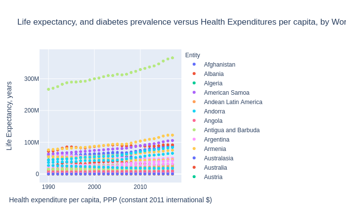
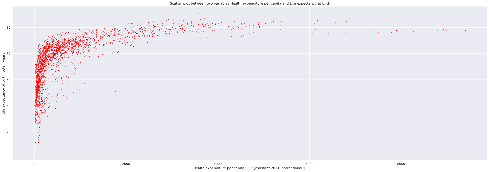

# Health, Nutrition and Economic Trends.

## What concerns arise as the world becomes more developed?

Over the course of time, lifestyles have been stable for most cultures. However, in the last 40 years, with the advent of globalization, the pace of change has quickened across the globe.

#   Overview

The following indicators of population health and progress were examined in this analysis.

Indicators 
Rural Population (as a Percentage of the total), Health Expenditures, Life Expectancy, Diabetes Prevalence) 

Time Spans of Interest
1960-2020  

Regions

"Arab World",	"Caribbean small states",	"East Asia & Pacific",	"Euro area",	"Europe & Central Asia"

In October 2020,this project was embarked on by OPA Towobola to explore and organize data and analysis on world trends. The main spheres of inqiry were in energy (production, consumption), health (longevity and disease rates) and development (urbanization and GDP). 

Population dispersal has been changing over the course of the period from 1960-2000. Across various world regiosn, the percentage of the population that is rural has been declining. 

The initial intent was to link these, so as to determine linkages. One question that could be answered is whether urbanization trends are promoting better or worse health. A similar question that could be answered is whether promiximity to energy sources (power lines) is linked to health trends for any demograhic group in particular. 

Observations of trend plots show that generally infant mortality drops with advancements in technology and development, such as higher Gross Domestic Product (GDP)

However, there appear to be some side-effects associated with development trends. Studies of this are still underway. 
One possible indicator of this is the rising rate of Autism diagnoses. Shown below is an apparent rise in the impact of non-communicable diseases.

In order to further understand the impact of development, it was necessary to examine the associated rise in health expenditures.
The graph below shows how life expectancy has increased as countries have spent more on health care (whether from direct individual payment 
or from third-party payments) 

The scatter matrix below shows a more detailed view of health expenditure on various measures of health.  

## Dataset source
*https://www.kaggle.com/theworldbank/health-nutrition-and-population-statistics/notebooks?sortBy=dateRun&group=profile&pageSize=20&datasetId=399

https://ourworldindata.org/

## Steps in the analysis
* __Data retrieval__ Data was retrieved from various sources, as referenced above.
* __Review__  Review existing literature.
* __Import__  Pandas turned out to be useful. After importing the datasets into dataframes, it was straightforward to make plots
* __Examination__ Quick preview of data in python and in a spreadsheet.
* __In-Dept Analysis__ A more detailed review of the data was performed.

### Extra
* [The decline of civilizations](https://www.bbc.com/future/article/20190218-are-we-on-the-road-to-civilisation-collapse)
* [Family structure and economic impact](https://www.dailysignal.com/2020/08/07/the-collapse-of-the-traditional-american-family//)
